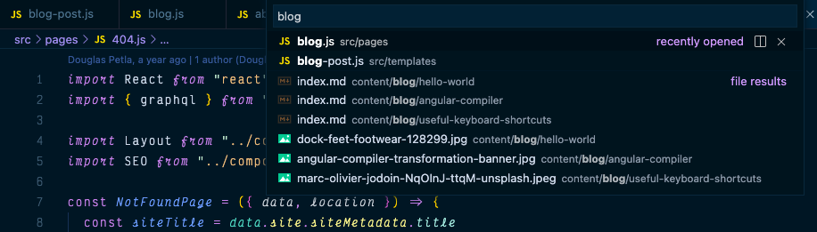
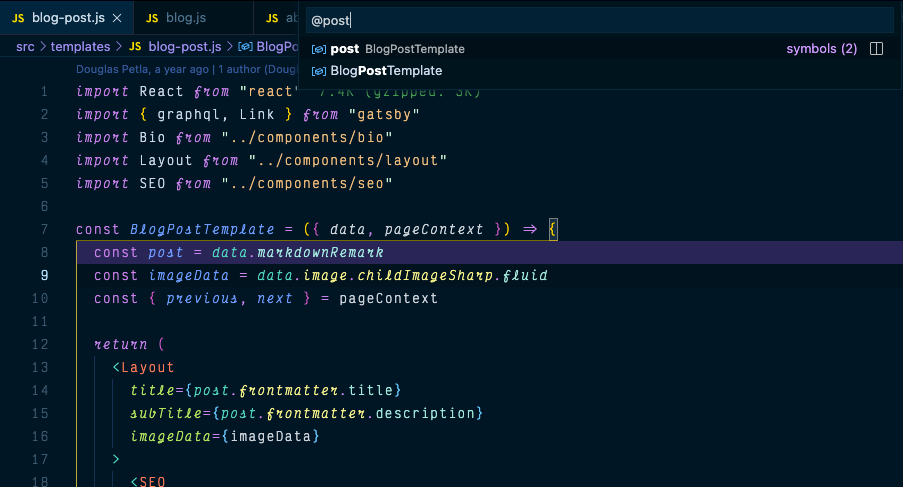
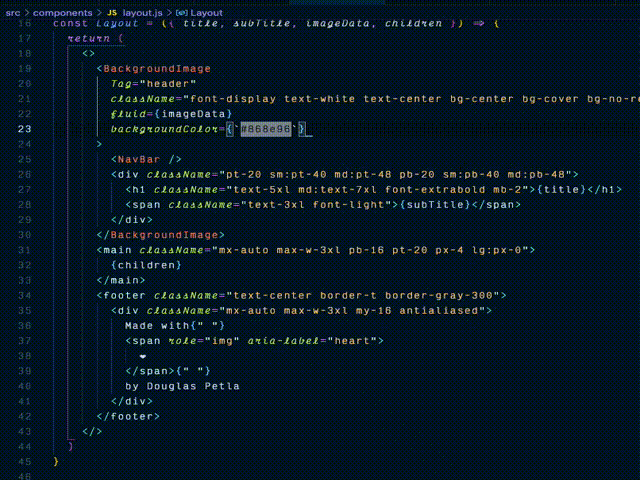

<h1 name="top">Useful Keyboard Shortcuts</h1>

While there is a trend among some programmers to use only the keyboard to become faster and more productive, I can't see myself ditching the mouse entirely for the time being.

Although learning a specific shortcut might make you a little slower while you are still trying to remember the key combinations and developing the memory muscle for each task, it's easy to notice the benefits of incorporating some useful shortcuts into your workflow.

To make this article simple and cleaner I'll group my most used shortcuts into 3 sections.
- [VS Code Top 10 Shortcuts](#vscode)
  - [Navigation](#vscode-navigation)
  - [Selection](#vscode-selection)
  - [Edition](#vscode-edition)
- [Chrome Top 5 Shortcuts](#chrome)
- [MacOs Code Top 3 Shortcuts](#macos)

 

-----------
<h2 name="vscode">VS Code Top 10 Shortcuts</h2>

<h3 name="vscode-navigation">Navigation</h3>

#### _Go To File_ (⌘P)
Instead of searching for a specific file, I prefer to use this shortcut and start typing the name of a file or even part of the file's path or its extension, or even a little bit of everything. Files that are already open in the editor will be at the top of the list, so they are easy to select.

_ps.: To go to the last file you had opened, you can use this shortcut twice in a roll. (`⌘P` + `⌘P`)_

#### _Go To Symbol_ (⇧⌘O)
Display a list of all symbols in a file. Type `:` to group them by category.

#### _Go Back_ (^-)
I frequently `⌘[mouse click]` a symbol to go to its definition, and most often, I'll keep digging into more symbols definitions, moving around multiple files.  I find it very useful to quickly go back (`^-`) and undo my definition drillings.

#### _Cursor Undo_ (⌘U)
This one is straightforward but helpful; it will undo every cursor action, selection, position, etc.

<h3 name="vscode-selection">Selection</h3>

#### _Expand or Shrink Selection_ (⇧⌃⌘[◀ or ▶])

#### _Add Selection to Next Find Match_ (⌘D)

<h3 name="vscode-edition">Edition</h3>

#### _Rename Symbol_ (F2)
#### _Move Line Up/Down_ (⌥[▲ or ▼])
#### _Copy Line Up/Down_ (⇧⌥[▲ or ▼])
#### _Add Cursor Above/Below_ (⌥⌘[▲ or ▼])

 

-----------
<h2 name="chrome">Chrome Top 5 Shortcuts</h2>

#### _New Tab_ (⌘T)
#### _Close Tab_ (⌘W)
#### _New Incognito Window_ (⇧⌘N)
#### _Toggle Dev Tools_ (⌥⌘I)
#### _Navigate Between Tabs_ (⌥⌘[◀ or ▶])

 

-----------
<h2 name="macos">MacOs Top 3 Shortcuts</h2>

#### _Spotlight search_ (⌘[space bar])
 Spotlight search
	switch between apps (vs ⌘ + tab)
	basic calculation or conversions
#### _Screenshot_ (⇧⌘4)
#### _Open App Settings_ (⌘,)

# CLOSING REMARKS!!!!

